<style>
  footer {
    text-align: left;
    font-size: .30em;
  }
</style>

<style scoped>
  h1 {
    text-shadow: #000 1px 0 10px;
  }
</style>

# Unlocking Your APIs With GraphQL

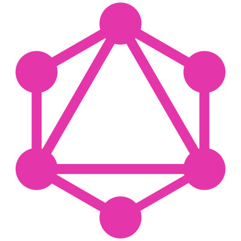

<!-- Work at Qoria formally FamilyZone -->
<!-- Our experience adopting GraphQl, why we felt it was a good idea, how it went, and what we learnt from the experience -->

---

# REST is full of lies

---

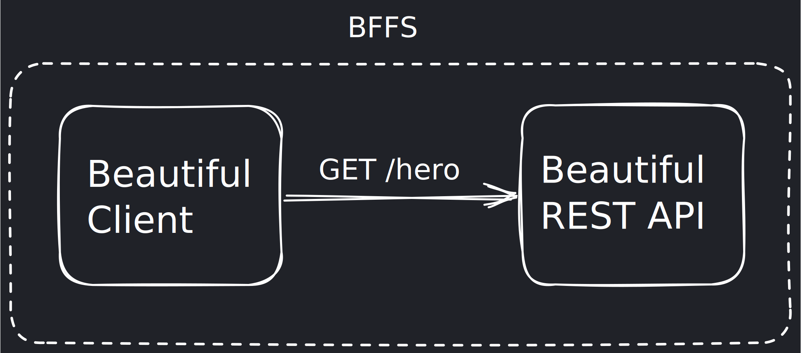

<!-- Using starwars as example data as that matches the GraphQL official documentation -->

---

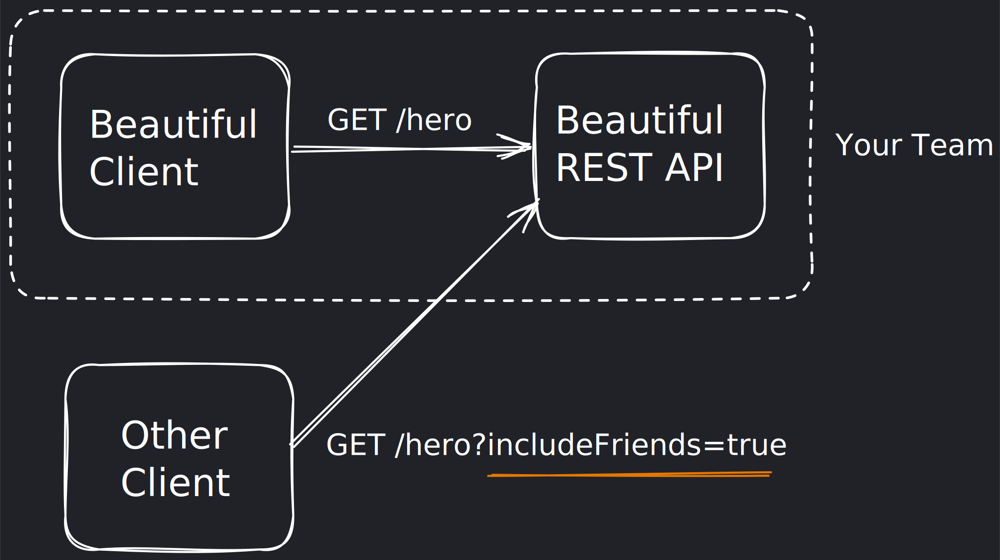

---

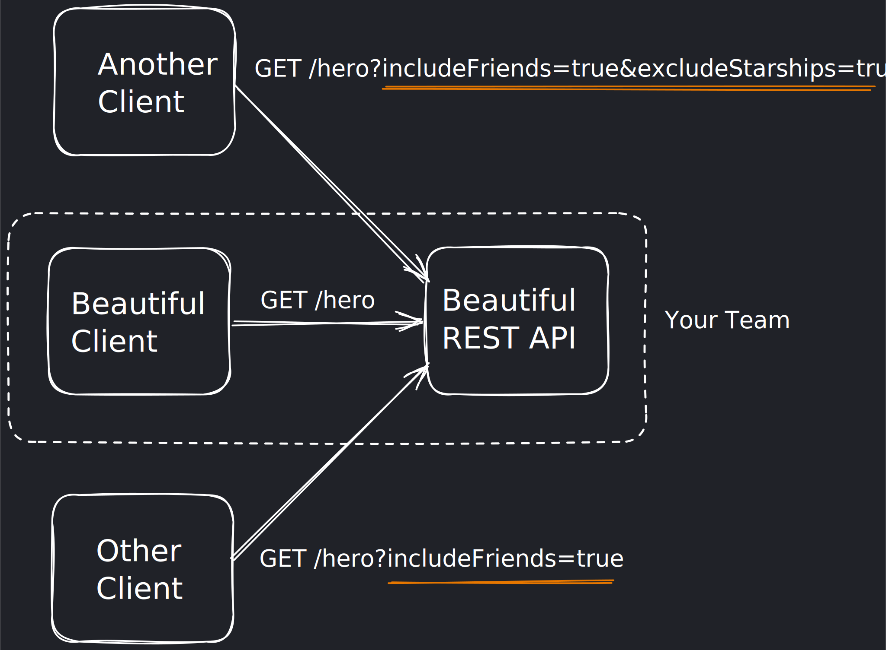

---

## Problems?

* N+1
* Overfetching & Underfetching
* Server / Client Coupling

---

The Creation of GraphQL


---

Overfetching Underfetching
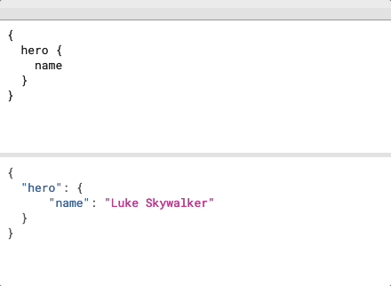

---

Hierarchical Data
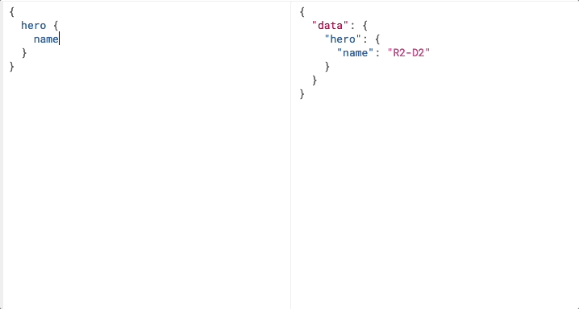

---

## Hierarchical Data in Rest

* `GET /hero/{id} `
* `GET /hero/{id}/friends`
* `GET /hero/{id}/spaceships`
* `GET /hero`
* `GET /movie/{id}/hero`
* `GET /movie/{id}/hero/{friends?, spaceships?}`

---

Versionless Schema
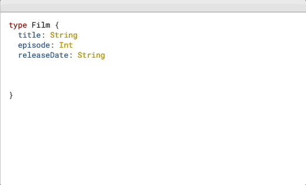

---

Strongly Typed Schema
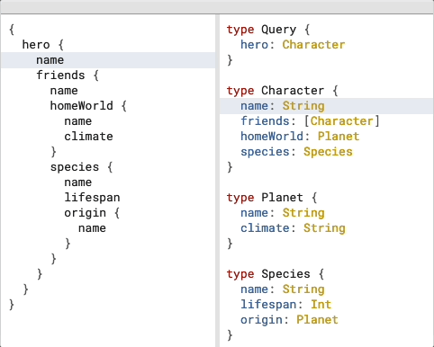

---

DevX Tooling
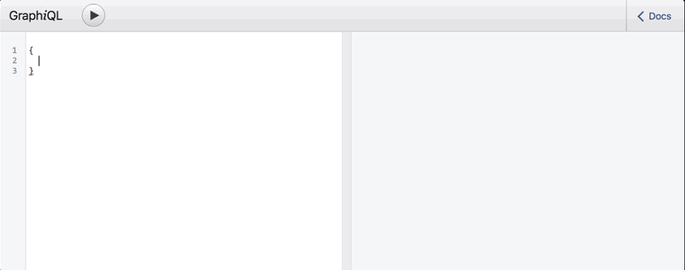

---


---

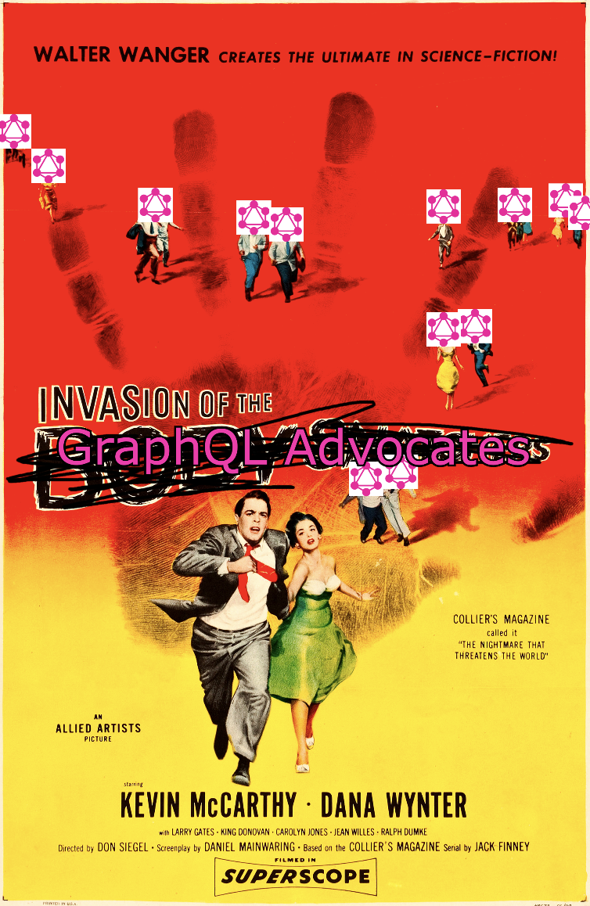


---


---


---

Ok, but how do I build it?

---

<style scoped>
  p {
    display: flex;
    justify-content: space-evenly;
    margin: 1em;
  }
</style>

It's dangerous to go alone, take these.


---
<style scoped>
  section {
    display: grid;
    grid-template-columns: 1fr 1fr;
    gap: 1em;
    align-content: center;
  }

  marp-pre {
    margin: 0px
  }
</style>

```gql
# Schema

type Query {
  hero(episode: Episode): Character
}

type Character {
  name: String!
  appearsIn: [Episode]!
  friends: [Character]!
}
```

```js
// JS Code

export const resolvers = {
  Query: {
    hero: (episode) => { ... },
  },
  Character: {
    friends: (parent) => { ... },
  }
}
```

---

N+1? Dataloaders.

---

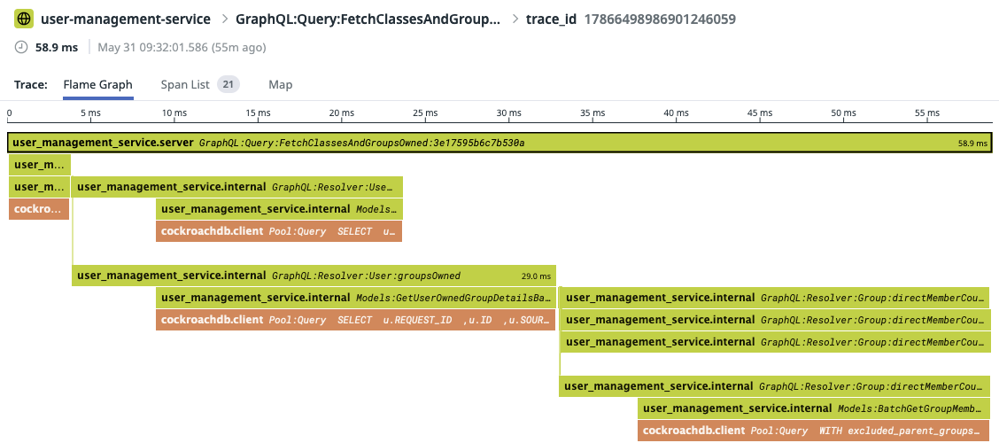

---

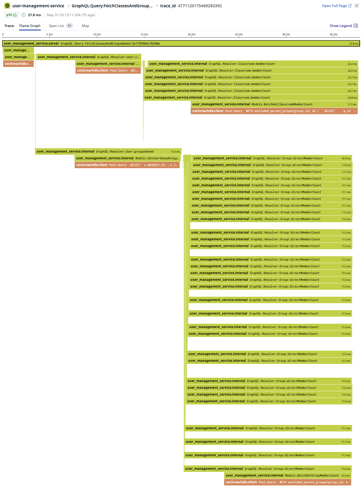

---

Pagination (Relay)

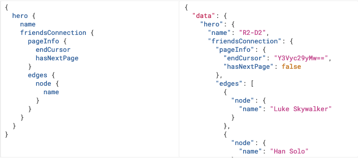

---

Choosing your page size matters a lot

---


---

.svg)

---


---
Nested Pagination?
```gql
query ($cursor:ID!, $nestedCursor:ID) {
  hero {
    name
    friendsConnection(first: 10, after: $cursor) {
      pageInfo {
        endCursor
        hasNextPage
      }
      edges {
        node {
          name
          friendsConnection(first: 10, after: $nestedCursor) {
            pageInfo {
              endCursor
              hasNextPage
            }
            edges {
              node {
                name
              }
            }
          }
        }
      }
    }
  }
}
```

---

<style scoped>
  section {
    display: grid;
    grid-template-columns: 1fr 1fr;
  }
  p {
    grid-column: 1 / span 2;
  }
</style>

Query Complexity

```gql
{
  heroes(first: 100) {
    friends(first: 100) {
      friends(first: 100) {
        friends(first: 100) {
          name
        }
      }
    }
  }
}
```

* Limit Nesting Depth
* Limit Overall Complexity

---

## Observability

Demo Time

---

## Next Steps: Federation

---

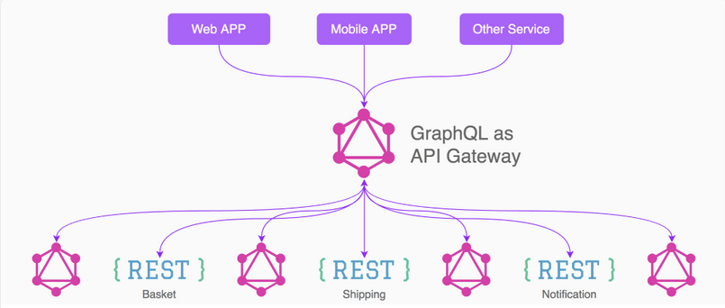

---


---

<style scoped>
  section {
    display: grid;
    grid-template-columns: 1fr 1fr;
    grid-template-rows: auto auto 1fr;
    grid-auto-flow: column;
    align-items: start;
  }
  h1 {
    grid-column: span 2;
  }
  ul {
    align-self: start;
  }
</style>

# Summary

### For
* Lots of clients
* Lots of query parameters
* Code generation

### Against
* Requires rework
* Additional Complexity
* BFFS

---

# Thanks

- Source Code: [github.com/dylanrjohnston/graphql-talk](https://github.com/dylanrjohnston/graphql-talk)
- Slides: [dylanj.xyz/graphql-talk](https://dylanj.xyz/graphql-talk)